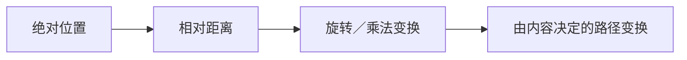

在笔者对transformer等一系列VLA的了解后，经过学长的指点，决定回归基础，从线性注意力开始打好基础。
首先聊聊一个注意力模型中最重要的部分：
- **Q：Query（查询）**——当前 token 想找什么信息
- **K：Key（键）**——每个 token 用什么特征供别人匹配
- **V：Value（值）**——匹配成功后，实际取走什么信息
实际上，我们需要解决的是一个Q,K,V→O的映射。

以带因果掩码的 Softmax 注意力为例。设 $M\in\{0,1\}^{n\times n}$，其中 $M_{ij}=0$ 表示该位置被屏蔽。暂时省略缩放因子 $1/\sqrt{d_k}$，其未归一化注意力权重可以写为：
$$
A=\exp\left(QK^{\mathsf T}+\log M\right)
=\exp\left(QK^{\mathsf T}\right)\odot M
$$

完整的注意力输出还需要进行归一化：
$$
O=D^{-1}AV,\qquad D=\operatorname{Diag}(A\mathbf 1)
$$

其中，$\odot$ 表示 Hadamard 积。标准注意力需要显式计算并保存 $n\times n$ 的注意力矩阵，因此其关于序列长度 $n$ 的时间复杂度为 $O(n^2d)$，注意力矩阵本身的空间复杂度为 $O(n^2)$。
# 线性注意力的历史变化
## 早期线性注意力的表示
$$
O= \left(\left(QK^{\mathsf T}\right) \odot M\right)V
$$
早期一种最直接的线性化思路，是去掉指数函数，并使用未经归一化的点积作为相似度。仅仅去掉 $\exp$ 并不会自动降低复杂度；真正的关键是，此时可以利用矩阵乘法的结合律，并通过前缀状态避免显式构造 $n\times n$ 的注意力矩阵。将其写成分量形式，笔者认为其可以更清楚地引出 State 的概念：
$$
\mathbf{\mathit{o}}_{t} = \sum_{j = 1}^{t} \mathbf{\mathit{v}}_{j} \left(\mathbf{\mathit{k}}_{j}^{\top} \mathbf{\mathit{q}}_{t}\right) = \sum_{j = 1}^{t} \left(\mathbf{\mathit{v}}_{j} \mathbf{\mathit{k}}_{j}^{\top}\right) \mathbf{\mathit{q}}_{t} = \left(\sum_{j = 1}^{t} \mathbf{\mathit{v}}_{j} 
\mathbf{\mathit{k}}_{j}^{\top}\right) \mathbf{\mathit{q}}_{t}
$$
$$
\mathbf{\mathit{o}}_{t}=\mathbf{\mathit{S}}_{t}\mathbf{\mathit{q}}_{t},
\qquad
\mathbf{\mathit{S}}_{t}=\mathbf{\mathit{S}}_{t-1}+\mathbf{\mathit{v}}_{t}\mathbf{\mathit{k}}_{t}^{\top}
$$

这样，注意力就被写成了一个以 $S_t$ 为状态的线性递推模型：历史信息被压缩进固定大小的状态 $S_t$，每一步只需更新状态并与当前的 $q_t$ 相乘。若 Key 和 Value 的维度分别为 $d_k$ 和 $d_v$，其时间复杂度为 $O(nd_kd_v)$，递推推理时的额外状态空间为 $O(d_kd_v)$。因此，在将特征维度视为常数时，其关于序列长度 $n$ 的时间复杂度由 $O(n^2)$ 降为 $O(n)$，并且不再需要保存随 $n^2$ 增长的注意力矩阵。

## 从Attention到线性RNN

## 我们为什么需要遗忘
目前看来我们的线性Attention本质上就是个cumsum，所有的历史信息的等权的叠加，那么遇上token足够多的情况，每个token的信息占比就会变得极小，即每个token的记忆都模糊了起来。
必要的，我们需要遗忘一些东西，引入遗忘效应后得到了这样的算式。
$$
\mathbf{\mathit{o}}_{t}=\mathbf{\mathit{S}}_{t}\mathbf{\mathit{q}}_{t},
\qquad
\mathbf{\mathit{S}}_{t}=\gamma\mathbf{\mathit{S}}_{t-1}+\mathbf{\mathit{v}}_{t}\mathbf{\mathit{k}}_{t}^{\top}
$$
这样在记忆上的就近原则可以保证，在有限状态容量下主动提高近期信息的分辨率。此处的 $\gamma$可以推广为可学习参数、对角矩阵或位置相关的 $\gamma_t$。
从这里可以看到线性注意力逐渐摆脱了对 Softmax 的单纯模仿：**它开始围绕“应该保留什么、遗忘什么”发展自身的记忆机制。DFW、Mamba、Mamba2、GLA 等工作都可以放进输入相关遗忘门这条线上理解。不过，它们并不是同一个模型的简单迭代：DFW 和 GLA 更接近矩阵状态形式的线性注意力，Mamba 属于选择性状态空间模型，而 Mamba2 又通过 State Space Duality 明确建立了 SSM 与注意力之间的联系。** 它们的共同点是让当前输入决定状态应该保留、写入或读出哪些内容。

- DFW：主要目标是把已经预训练好的 Transformer 微调成具有固定大小状态的递推模型，从而避免自回归生成时不断增长的 KV Cache。($G_t$是低秩门控矩阵)
$$
S_t=G_t\odot S_{t-1}+v_tk_t^{\mathsf T}
$$

- Mamba：选择性状态空间模型，由当前的token决定保留、写入和读取。传统模式下，所有token的传播方式类似，mamba的改动是让离散化步长 $\Delta_t$、写入参数 $B_t$ 和读出参数 $C_t$ 由当前输入 $x_t$ 决定。

- Mamba2：可以理解为一个线性时间的选择性 SSM 递推，也是一个带输入相关衰减掩码的结构化线性注意力。它将状态转移进一步约束为每个 head 内的标量乘单位阵，即可以用输入相关标量 $a_t$ 表示。把递推完全展开后，会得到类似注意力的二次形式：
$$
O=\left(L\odot QK^{\mathsf T}\right)V,
\qquad
L_{ij}=\begin{cases}
\displaystyle\prod_{r=j+1}^{i}a_r,&i\ge j\\
0,&i<j
\end{cases}
$$
相比 Mamba，Mamba2 牺牲了一部分状态转移矩阵的自由度，把对角结构进一步简化成标量结构，但换来了更适合 Tensor Core 的分块矩阵乘法。论文报告其核心层比 Mamba 快约 2～8 倍。它的重要性在于说明：**SSM 和 Attention 未必是两种互斥架构，它们可能只是同一结构化矩阵的递推形式与并行形式。**

- GLA：是从二维矩阵状态出发：
$$
S_t=G_t\odot S_{t-1}+v_tk_t^{\mathsf T},
\qquad
o_t=S_tq_t
$$
如果直接让网络预测完整的 $d_v\times d_k$ 门控矩阵 $G_t$，参数量和计算量都会过大。GLA 因此采用低秩或按某一维广播的参数化方式：先由 $x_t$ 生成一个较小的门控向量，再扩展到二维状态。这样既比单一标量 $\gamma_t$ 更细粒度，又不会真的为每个状态元素配置一套独立预测参数。

## TTT：将状态更新理解为在线学习
本文随即引用了更高层的Test-Time Train（即TTT）视角，它不再把 $S_t$ 仅仅看成一块被动累加的记忆，而是把它看成一个在序列内部不断被训练的模型参数。
对于每个 token，可以把 $(k_t,v_t)$ 看成一条训练样本：$k_t$ 是输入，$v_t$ 是目标；把 $q_t$ 看成真正需要预测的查询。状态更新可以统一写成：

$$
S_t=S_{t-1}-\eta_t\nabla_{S_{t-1}}
\mathcal L\bigl(f(S_{t-1};k_t),v_t\bigr)
$$

然后使用更新后的状态回答查询：

$$
o_t=f(S_t;q_t)
$$
 原文用压缩作了一个很形象的类比：历史 token 是待压缩的数据，$S_t$ 是固定大小的压缩包，$f$ 是解压器，优化器是压缩算法，而损失函数衡量压缩后还能否恢复需要的信息。这个类比让我第一次把 RNN 的状态容量、在线学习和 In-Context Learning 联系起来。模型在上下文中表现出的学习能力，可以理解为它在前向传播过程中利用当前序列持续更新内部状态。
**优势在于，设计序列模型的问题就从“写一个递推公式”，提升为“选择什么内部模型 $f$、什么损失函数 $\mathcal L$、什么优化规则”。**

笔者未来预期会写一篇TTT的文档，敬请期待喵~

## DeltaNet：除旧迎新
损失函数的发展历程：从最初线性注意力的损失函数是$-v^{\mathsf T}Sk$，这个无下界的函数，可能会导致状态S趋于无穷，RetNet 的衰减可被解释为增加正则化，但内积目标仍没有直接要求 $Sk$ 接近 $v$。
更自然的选择是平方误差：

$$
\mathcal L(S;k,v)=\frac{1}{2}\lVert Sk-v\rVert^2
$$

对它执行一步梯度下降，就得到 DeltaNet 的状态更新：

$$
S_t=S_{t-1}+\eta_t\left(v_t-S_{t-1}k_t\right)k_t^{\mathsf T}
$$
由于$\eta_t$总可以吸收到$k_t$和$v_t$的定义中去，如果只考虑$\eta_t=1$的情况，则有
$$
\begin{aligned}\mathbf{\mathit{S}}_{t} = & \mathbf{\mathit{S}}_{t - 1} - \left(\mathbf{\mathit{S}}_{t - 1} \mathbf{\mathit{k}}_{t} - \mathbf{\mathit{v}}_{t}\right) \mathbf{\mathit{k}}_{t}^{\top} \\ = & \mathbf{\mathit{S}}_{t - 1} - \left(\mathbf{\mathit{S}}_{t - 1} \mathbf{\mathit{k}}_{t}\right) \mathbf{\mathit{k}}_{t}^{\top} + \mathbf{\mathit{v}}_{t} \mathbf{\mathit{k}}_{t}^{\top} \\ = & \mathbf{\mathit{S}}_{t - 1} \left(\mathbf{\mathit{I}} - \mathbf{\mathit{k}}_{t} \mathbf{\mathit{k}}_{t}^{\top}\right) + \mathbf{\mathit{v}}_{t} \mathbf{\mathit{k}}_{t}^{\top}\end{aligned}
$$
其中 $\mathbf{\mathit{S}}_{t - 1} \mathbf{\mathit{k}}_{t}$ 可以理解为新输入 $\mathbf{\mathit{k}}_{t}$ 在旧模型 $\mathbf{\mathit{S}}_{t - 1}$ 下的预测结果。
从笔者的角度来看，先减后加是先减去模型对$k_t$的旧认知，然后根据 $\left(\mathbf{\mathit{k}}_{t} , \mathbf{\mathit{v}}_{t}\right)$ 补充新认知。

## 往期回顾与推广更迭
由于线性RNN最理想的（即GPU高效的）并行算法是充分使用矩阵乘法的形式（理由如下：程序的实际速度同时受到计算吞吐量和显存带宽限制。矩阵乘法的数据复用率高、算术强度高，更容易接近 GPU 的峰值计算性能。），所以我们可以把之前的
$$S_t=S_{t-1}+\left(v_t-S_{t-1}k_t\right)k_t^{\mathsf T}$$记 $\mathbf{\mathit{u}}_{t} = \mathbf{\mathit{v}}_{t} - \mathbf{\mathit{S}}_{t - 1} \mathbf{\mathit{k}}_{t}$ ，那么 $\mathbf{\mathit{S}}_{t} = \mathbf{\mathit{S}}_{t - 1} + \mathbf{\mathit{u}}_{t} \mathbf{\mathit{k}}_{t}^{\top}$ ，也就是说它只是在最早的线性Attention基础上把 $\mathbf{\mathit{V}}$ 换成了 $\mathbf{\mathit{U}} = \left[\right. \mathbf{\mathit{u}}_{1} , \mathbf{\mathit{u}}_{2} , ... , \mathbf{\mathit{u}}_{n} \left]\right.^{\top}$ ，将它迭代 $t - 1$ 次，我们有  
$$
\mathbf{\mathit{S}}_{t - 1} = \sum_{j = 1}^{t - 1} \mathbf{\mathit{u}}_{j} \mathbf{\mathit{k}}_{j}^{\top} \Rightarrow \mathbf{\mathit{u}}_{t} = \mathbf{\mathit{v}}_{t} - \left(\sum_{j = 1}^{t - 1} \mathbf{\mathit{u}}_{j} \mathbf{\mathit{k}}_{j}^{\top}\right) \mathbf{\mathit{k}}_{t} = \mathbf{\mathit{v}}_{t} - \sum_{j = 1}^{t - 1} \mathbf{\mathit{u}}_{j} \left(\mathbf{\mathit{k}}_{j}^{\top} \mathbf{\mathit{k}}_{t}\right)
$$
### 复杂度在该条件下如何降到线性的
不难发现，在矩阵形势下，最后的等式写成矩阵形式是 $\mathbf{\mathit{U}} = \mathbf{\mathit{V}} - \left(\mathbf{\mathit{K}} \mathbf{\mathit{K}}^{\top} \bigodot \mathbf{\mathit{M}}^{-}\right) \mathbf{\mathit{U}}$ ，其中 $\mathbf{\mathit{M}}^{-} = \mathbf{\mathit{M}} - \mathbf{\mathit{I}}$ ，这是一个线性方程组，它的解可以直接表示为  
$$
\mathbf{\mathit{U}} = \left(\right. \mathbf{\mathit{I}} + \underset{记为 \mathbf{\mathit{B}}}{\underbrace{\mathbf{\mathit{K}} \mathbf{\mathit{K}}^{\top} \bigodot \mathbf{\mathit{M}}^{-}}} \left.\right)^{- 1} \mathbf{\mathit{V}}
$$
  
这里出现了 $\left(\right. \mathbf{\mathit{I}} + \mathbf{\mathit{B}} \left.\right)^{- 1}$ ，一个 $n \times n$ 矩阵的逆，标准复杂度是 $\mathcal{O} \left(n^{3}\right)$ ，比Softmax Attention（复杂度是$\mathcal{O} \left(n^{2}\right)$）还高！不过好在我们不需要显式的逆而是只要 $\mathbf{\mathit{U}}$ ，这可以转化为解方程组 $\left(\mathbf{\mathit{I}} + \mathbf{\mathit{B}}\right) \mathbf{\mathit{U}} = \mathbf{\mathit{V}}$ ，复杂度降到 $\mathcal{O} \left(n^{2}\right)$ 。进一步地，利用 $\mathbf{\mathit{I}} + \mathbf{\mathit{B}}$ 是下三角阵以及 $\mathbf{\mathit{B}}$ 的低秩结构，可以将复杂度降到线性，写成分块矩阵乘法后就可以充分利用GPU。

### 前期工作的复用
最后的等式写成矩阵形式是 $\mathbf{\mathit{U}} = \mathbf{\mathit{V}} - \left(\mathbf{\mathit{K}} \mathbf{\mathit{K}}^{\top} \bigodot \mathbf{\mathit{M}}^{-}\right) \mathbf{\mathit{U}}$ ，其中 $\mathbf{\mathit{M}}^{-} = \mathbf{\mathit{M}} - \mathbf{\mathit{I}}$ ，这是一个线性方程组，它的解可以直接表示为  
不出意外，我们伟大的成果又要经历遗忘门等上述其已经经历的改变，直观的保留Delta Rule的样子，学者们最后给出的式子如下： 
$$
\mathbf{\mathit{S}}_{t} = \gamma_{t} \mathbf{\mathit{S}}_{t - 1} + \eta_{t} \left(\mathbf{\mathit{v}}_{t} - \mathbf{\mathit{S}}_{t - 1} \mathbf{\mathit{k}}_{t}\right) \mathbf{\mathit{k}}_{t}^{\top} 
$$

## 线性注意力反哺softmax attention
笔者总计一下上面的所有故事线，不难发现，softmax一直在退步（大部分的学术研究都是在未来压缩KV Cache在做减法），而线性attention则没有过多考虑这个问题，所以一直有着光明的未来。
$$
\begin{array}{c|c} 
\hline 
& \text{公式} \\[4pt] 
\hline 
\text{Softmax Attention} & (\exp(\boldsymbol{Q}\boldsymbol{K}^{\top})\odot \boldsymbol{M})\boldsymbol{V} \\[4pt] 
\text{最早的线性Attention} & (\boldsymbol{Q}\boldsymbol{K}^{\top}\odot \boldsymbol{M})\boldsymbol{V} \\[4pt] 
\text{加入遗忘门后} & (\boldsymbol{Q}\boldsymbol{K}^{\top}\odot \boldsymbol{\Gamma})\boldsymbol{V} \\[4pt] 
\text{DeltaNet} & (\boldsymbol{Q}\boldsymbol{K}^{\top}\odot \boldsymbol{M})(\boldsymbol{I} + \boldsymbol{K}\boldsymbol{K}^{\top}\odot \boldsymbol{M}^-)^{-1}\boldsymbol{V} \\[4pt] 
\text{Gated DeltaNet} & \begin{gathered}((\boldsymbol{Q}\boldsymbol{K}^{\top}\odot \boldsymbol{M})(\boldsymbol{I} + \boldsymbol{K}\boldsymbol{K}^{\top}\odot \boldsymbol{M}^-)^{-1}\odot\boldsymbol{\Gamma})\boldsymbol{V} \\ =(\boldsymbol{Q}\boldsymbol{K}^{\top}\odot \boldsymbol{\Gamma})(\boldsymbol{I} + \boldsymbol{K}\boldsymbol{K}^{\top}\odot \boldsymbol{\Gamma}^-)^{-1}\boldsymbol{V}\end{gathered} \\[4pt] 
\hline 
\end{array}
$$
其中  
$$
\Gamma_{i , j} = \begin{cases} \prod_{\tau = j + 1}^{i} \gamma_{\tau} , & i > j \\ 1 , & i = j \\ 0 , & i < j \end{cases}
$$
那么是时候将softmax attention转化为线性attention了（喜）
### 我们为什么要转化
刚刚只是很简单的提到了，我们退步的softmax和进步的线性attention，而线性attention已经发展出了许多原始softmax attention都没有的状态更新机制，比如我们刚刚提到的遗忘门，Delata Rule等等等，这些机制都是由$QK^T$这种线性内积形式推倒出来的，所以学者们想要做的就是把 $exp \left(\mathbf{\mathit{Q}} \mathbf{\mathit{K}}^{\top}\right) = \phi \left(\mathbf{\mathit{Q}}\right) \phi \left(\right. \mathbf{\mathit{K}} \left.\right)^{\top}$ 。

### 如何转化
经过 $exp \left(\mathbf{\mathit{Q}} \mathbf{\mathit{K}}^{\top}\right) = \phi \left(\mathbf{\mathit{Q}}\right) \phi \left(\right. \mathbf{\mathit{K}} \left.\right)^{\top}$ 的$核技巧$的转化后，我们要做的其实就是将上述表格中的线性Attention的 $\mathbf{\mathit{Q}} , \mathbf{\mathit{K}}$ 换成 $\phi \left(\mathbf{\mathit{Q}}\right) , \phi \left(\mathbf{\mathit{K}}\right)$ ，最后再设法恢复 $exp$ 并归一化，就得到新的Softmax Attention变体了。
这就是：
$$O=softmax(QK^T)V$$
因此从数学上说，Softmax Attention 本身就是一种无限维线性 Attention。
例如，代入到遗忘门的公式，我们有  
$$
\left(\right. \phi \left(\mathbf{\mathit{Q}}\right) \phi \left(\mathbf{\mathit{K}} \left.\right)^{\top} \bigodot \mathbf{\Gamma}\right) \mathbf{\mathit{V}} = exp \left(\mathbf{\mathit{Q}} \mathbf{\mathit{K}}^{\top} + log \mathbf{\Gamma}\right) \mathbf{\mathit{V}}
$$
- 当遗忘率是常数时，会得到类似 ALiBi 的距离偏置；
- 当遗忘率依赖输入时，会得到 FoX 一类带遗忘门的 Softmax Attention；
- 将 DeltaNet 的结构映射回指数核后，可以得到 DeltaFormer。
**PS:**
**ALiBi**：研究怎样让 Transformer 从短序列外推到长序列；
**FoX**：研究怎样给 Softmax Attention 加入真正的数据依赖遗忘门； 
**DeltaFormer**：研究怎样把 Transformer 解释成关联记忆，并把 DeltaNet 的纠错更新移植到 Softmax Attention。

## 因反哺产生的PaTH Attention
位置编码笔者在前期学习transformer的时候有所学习，
它的发展历程是：

与之前学习的不同的是，PaTH Attention是从位置编码的角度将DeltaNet反哺到Softmax Attention。那我们从DeltaNet出发，其中的矩阵：$I-w_tw_t^{\mathsf T}$，学者们定义当 $\lVert w_t\rVert=\sqrt{2}$ 时，它是 Householder 反射矩阵；连续相乘后，可以描述从位置 $j$ 到位置 $i$ 之间累积的变换。于是，$q_i$ 与 $k_j$ 的相似度不再只由固定位置编号决定，而是由中间上下文产生的一系列变换共同决定。

这与 RoPE 使用预先规定的旋转不同：PaTH 的“位置”是内容相关的，因此更接近 Contextual Position Encoding。当 $W=K$ 时，PaTH 的注意力矩阵会化简出与 DeltaNet 高度相关的形式；在满足正交约束时，它又能像 RoPE 一样，把相对位置变换写成两个绝对变换的组合。换句话说，DeltaNet 原本用于更新记忆的结构，也可以被重新解释为给 $Q,K$ 注入上下文相关的位置。
至此，在softmax前的注意力矩阵已经初具雏形。
$$A = QK^\top \odot M - (QW^\top \odot M)(I + WW^\top \odot M^{-})^{-1}(WK^\top \odot M^{-})$$
从位置编码的角度看，PaTH是 [CoPE（Contextual Position Encoding）](https://papers.cool/arxiv/2405.18719) 的一种，它的位置并不是编号 $1,2,3,\cdots$ ，而是根据上下文内容自动生成的位置信号。类似地，FoX也可以看成是Contextual版的ALIBI。上下文相关的位置信息是当前线性Attention的主要特征，也可能是反哺Softmax Attention的主要方向。

笔者后期也会写同样一篇关于Flash Attention的文章，队终于这个直接求逆复杂度是 $\mathcal{O} \left(n^{3}\right)$ ，想办法利用 $\mathbf{\mathit{W}} \mathbf{\mathit{W}}^{\top}$ 的低秩特点将复杂度降低到 $\mathcal{O} \left(n^{2}\right)$ ，然后还要推反向传播，最后写成类似Flash Attention的高效实现，笔者表示震惊。

## 举例：MesaNet从梯度下降走向线性回归解析解
DeltaNet 使用 SGD 优化平方损失，而 $Sk$ 本身只是一个线性回归模型。既然线性回归存在解析解，MesaNet 就尝试直接维护这个解所需的统计量：
$$
G_t=\sum_{j=1}^{t}v_jk_j^{\mathsf T},
\qquad
H_t=\sum_{j=1}^{t}k_jk_j^{\mathsf T},
\qquad
S_t=G_tH_t^{-1}
$$
类似的，我们也需要引入遗忘门，并给 $\mathbf{\mathit{G}}_{t} , \mathbf{\mathit{H}}_{t}$ 加入遗忘门，然后求时加上对角阵 $\mathbf{\Lambda}_{t}$ 避免不可逆，总的模型是  
$$
\mathbf{\mathit{o}}_{t} = \mathbf{\mathit{G}}_{t} \left(\right. \mathbf{\mathit{H}}_{t} + \mathbf{\Lambda}_{t} \left.\right)^{- 1} \mathbf{\mathit{q}}_{t} , \mathbf{\mathit{G}}_{t} = \gamma_{t} \mathbf{\mathit{G}}_{t - 1} + \mathbf{\mathit{v}}_{t} \mathbf{\mathit{k}}_{t}^{\top} , \mathbf{\mathit{H}}_{t} = \gamma_{t} \mathbf{\mathit{H}}_{t - 1} + \mathbf{\mathit{k}}_{t} \mathbf{\mathit{k}}_{t}^{\top} (\text{36})
$$
从信号处理角度看，DeltaNet 类似 Least Mean Square，MesaNet 更接近 Recursive Least Square。解析解使 MesaNet 在许多情况下能够比单步梯度更新更接近局部最优，但这也是它的限制：

1. $H_t+\Lambda_t$ 不是简单的三角矩阵，求解线性方程的实现成本较高；
2. 目前常用共轭梯度法近似求解，并不完美；
3. 解析解依赖问题结构，损失或模型稍作修改后可能不再存在；
4. 它倾向于同时拟合全部历史数据，可能再次出现“全都记住但都很模糊”的问题；
5. Delta Rule 具有主动覆盖旧认知的能力，在长期精确记忆上未必弱于解析解。
只能说，这个故事告诉我们，路线永远不是只有一条，要多看，多想！
